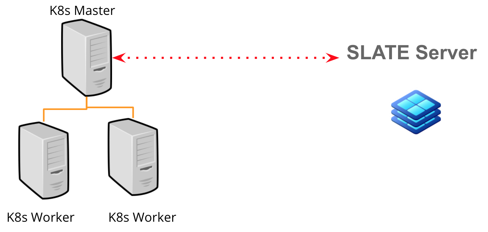

.. USCMST3 Kubernetes Deployment documentation master file, created by
   sphinx-quickstart on Tue May 12 07:22:54 2020.
   You can adapt this file completely to your liking, but it should at least
   contain the root `toctree` directive.

Welcome to USCMST3 Kubernetes Deployment's documentation!
=========================================================

.. toctree::
   :maxdepth: 2
   :caption: Contents:

..
   Indices and tables
   ==================

   * :ref:`genindex`
   * :ref:`modindex`
   * :ref:`search`

Introduction
============
The following documentation describes the steps followed in order to deploy a USCMS Tier-3 on top of Kubernetes, via SLATE.

`Kubernetes <https://kubernetes.io/>`_ is an industrial open-source container-orchestration system for automating application deployment, scaling, and management. It was originally designed by Google, and is now maintained by the Cloud Native Computing Foundation.

The `SLATE project <https://slateci.io/>`_ enables a federated "NoOPs" operations model that gives cyberinfrastructure developers the flexibility to innovate at scale, expanding the reach of domain specific science gateways and multi-site research platforms. It supports several T3-related components in its `applications list <https://portal.slateci.io/applications>`_, like Hosted CEs, HTCondor, OSG Frontier SQUID, etc.

Requirements
============
The following sets of requirements are necessary in order to use SLATE:

- Docker: Needed to start the SLATE container images for the services
- Kubernetes: To orchestrate the containers.
- At least 1 machine: To deploy the kubernetes (k8s) master, which will be in contact with the SLATE server, this machine (or others) can serve as the workers too to deploy your T3 components too.
- 2 Public Ips: The first for the k8s master, so the SLATE server can contact it. The second, for the ingress controller of the k8s load balancer (more on this, later).

Cluster Installation
====================
For Red Hat based Operating systems, please follow SLATE documentation on the matter.

https://slateci.io/docs/cluster/index.html

The link above offers guidance regarding:
-  OS setup (e.g.: disabling SE Linux, firewalld, add iptables rules, etc)
- Installing Docker and Kubernetes
- Configuring Kubernetes and Load Balancer
- Setup SLATE Master and Workers

For other Operating Systems and general online support, you can join the SLATE SLACK channel: https://slateci.slack.com/ 

Joining the SLATE federation and installing apps
================================================
In order to use SLATE, you will need to:

- Install the SLATE client
- Join the SLATE federation, register your cluster with it and define the groups that will have access to your cluster

Please, refer to the link below in order to perform these steps:

https://slateci.io/docs/tools/

Installing applications:
========================
Now that SLATE is ready to be used, you can start installing apps. 
We will use Squid as an example. The following link shows how to install SQUID:

https://portal.slateci.io/applications/osg-frontier-squid

Some notes:
The first step will be to download a yaml file, like this:
 
.. code-block:: bash

   $ slate app get-conf osg-frontier-squid > squid.yaml

You will need to edit this configuration file, according to your needs. The following is an example

.. code-block:: yaml

  Service:
    # Port that the service will utilize.
    Port: 3128

  SquidConf:
    IPRange: 10.0.0.0/8 192.168.0.0/16

  ExtraConf:
    Enabled: false
    Workers: 4
    Cpu_Affinity_Map: "process_numbers=1,2,3,4 cores=2,3,4,5"
    Logfile_Rotate: "10"

Please, store this yaml even after deployment. You will need it in order to re-deploy your component in the future. Deployment, as shown in the docs, is done through the clieng, e.g.:

.. code-block:: bash
  $ slate app install osg-frontier-squid --group ndcms --cluster notredame --conf squid.yaml

Verifying your installation
===========================
First, you need to see if your new installed application appears in the list of apps

.. code-block:: bash

  $ slate instance list --group ndcms
    Name                       Cluster   ID
    osg-frontier-squid-global  notredame instance_GwswqO_izOs

You can then, take a look at the SLATE logfiles for this application. You should see some "INFO success" lines, like below:

.. code-block:: bash

  $ slate instance logs instance_GwswqO_izOs
  Fetching instance logs...
  ========================================
  Pod: osg-frontier-squid-global-779784b59d-8c9gh Container: osg-frontier-squid
  Initializing cache for worker 1,2,3,4...
  2020-03-13 21:05:27,928 INFO success: frontier-squid entered RUNNING state, 
  process has stayed up for > than 1 seconds (startsecs)
  2020-03-13 21:05:27,928 INFO success: crond entered RUNNING state, process has 
  stayed up for > than 1 seconds (startsecs)

Redeploying your appplication
==========================
To re-deploy an application, you will need to uninstall it and re-install it again. For example:

.. code-block:: bash

  # Find your slate instance first
  $ slate instance list --group ndcms
  Name                       Cluster   ID
  osg-frontier-squid-global  notredame instance_GwswqO_izOs
  
  # Now, delete this instance using the proper ID:
  $ slate instance delete instance_GwswqO_izOs

  # Next, install it again using your yaml file
  $ slate app install osg-frontier-squid --group ndcms --cluster notredame --conf squid.yaml

Entering the app container for debugging
========================================
You can also enter the kubernetes container image in order to look at the Squid logs themselves. We will use the kubernetes client for this:

First, we find the kubernetes ID:

.. code-block:: bash

  $ kubectl get pods -A | grep frontier
  slate-group-ndcms   osg-frontier-squid-global-779784b59d-8c9gh    1/1     Running   
  0          3d18h

Then, we enter the container, making sure we provide the correct group namespace. The group is the first column in the "get pods" command line above.

.. code-block:: bash

  $ kubectl exec -it osg-frontier-squid-global-779784b59d-8c9gh -n slate-group-ndcms 
  bash

After that, you are inside the container and you can check the logfiles. E.g.:

.. code-block:: bash
  # tail /var/log/squid/access.log

  129.74.85.6 - - [13/Mar/2020:21:14:41.850 +0000] "GET 
  http://cvmfs.fnal.gov:8000/cvmfs/oasis/.cvmfswhitelist HTTP/1.1" 200 977 
  TCP_MISS:HIER_DIRECT 25 "- -" "-" "cvmfs libcvmfs 2.4.4 parrot-7-0-15"
  129.74.85.6 - - [13/Mar/2020:21:14:42.326 +0000] "GET http://cvmfs-stratum- 
 one.cern.ch/cvmfs/cms.cern.ch/.cvmfswhitelist HTTP/1.1" 200 1093 
  TCP_MISS:HIER_DIRECT 115 "- -" "-" "cvmfs libcvmfs 2.4.4 parrot-7-0-15"

After you are done with the container, type "exit" to exit the container.
